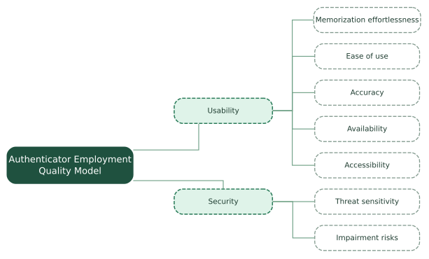

# AQUA-E: Authenticator Employment QM {#authenticator-employment-quality-model}

::: {.model-intro .employment}
**AQUA-E** has the same quality factors and subfactors as [**AQUA-A**](#authenticator-quality-model). The difference lies only in their definitions, which are documented in the [**Description**](#employment-table).
:::

## Structure {#employment-tree}

::: {.tree-figure}
{.quality-tree}
:::
