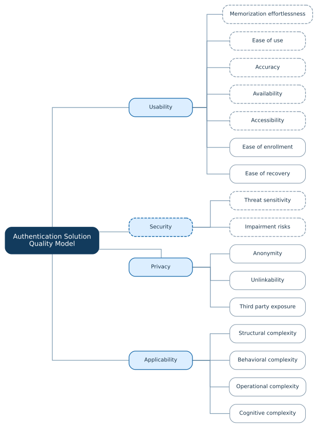

# Authentication Solution Quality Model {#authentication-solution-quality-model}

::: {.model-intro}
The authentication solution quality model derives the Security factor and its subfactors, as well as five Usability subfactors, from the authenticator employment. In addition, we identified two solution-specific Usability subfactors and two solution-specific quality factors: Privacy and Applicability. The [**Description**](#solution-table) documents them.
:::

## Structure {#solution-tree}

::: {.tree-figure}
{.quality-tree}
:::