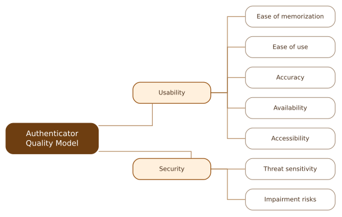

# AQUA-A: Authenticator QM {#authenticator-quality-model}

::: {.model-intro .authenticator}
We identified two quality factors that are inherent to authenticators: usability and security. They are documented in the [**Description**](#authenticator-table) along with their subfactors.
:::

## Structure {#authenticator-tree}

::: {.tree-figure}
{.quality-tree}
:::