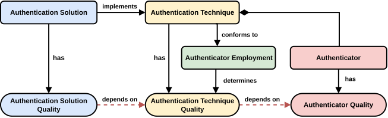

# [AQUA]{.acronym-literal}

::: {.floating-site-nav role="navigation" aria-label="Page navigation"}
[[AQUA]{.acronym-literal} Overview](authentication-quality-models.html){.floating-nav-link .active}
[Definitional Models](definitional-models.html){.floating-nav-link}
<!--[Prediction Models](prediction-models.html){.floating-nav-link}-->
:::

Welcome to the **[AQUA]{.acronym-literal} website**.

<!--
[AQUA]{.acronym-literal} is a modular quality modeling framework for authentication solutions. This website documents the framework, its definitional quality models, and the quality prediction models built upon it.
-->

[AQUA]{.acronym-literal} is a modular quality modeling framework for authentication solutions. This website documents the framework and its definitional quality models.

::: {.callout-note icon="false"}
## Current Status

This website reflects the current refinement of [AQUA]{.acronym-literal}. In the refined framework, **Authentication Technique Quality** replaces the previously proposed **Authenticator Employment Quality**: Authenticator Employment remains a central concept, but the resulting quality manifests in the Authentication Technique.

<!--
The framework and the related [AQUÆDICT]{.acronym-literal} quality prediction models are still under active development and may be subject to minor changes.
-->

[View the original AQUA artifact (Version 1.0)](versions/1.0/)
:::

## What is [AQUA]{.acronym-literal}?
Authentication solutions can differ substantially in quality. For example, passkey-based authentication can provide security advantages over password-based authentication [2], while multi-factor authentication tends to improve security at the cost of usability compared with single-factor authentication [3]. However, existing approaches use inconsistent terminology [4] and often do not distinguish whether a quality effect originates from the authenticator itself, from how authenticators are composed, or from the concrete implementation of the authentication solution [5–7].

[AQUA]{.acronym-literal} addresses this problem through a **modular quality modeling framework for authentication solutions**. It decomposes authentication into four interrelated concepts—**Authenticator**, **Authenticator Employment**, **Authentication Technique**, and **Authentication Solution**—so that quality properties can be associated with their conceptual origin and their propagation through an authentication solution can be modeled explicitly.

# Authentication Concepts

[AQUA]{.acronym-literal} decomposes authentication into four interrelated concepts: **Authenticator**, **Authenticator Employment**, **Authentication Technique**, and **Authentication Solution**. This decomposition distinguishes quality effects originating from inherent authenticator properties, from the way authenticators are composed, and from their concrete technical realization.

::: {.concept-grid}

::: {.concept-card .concept-authenticator}

### Authenticator

Atomic concept

An **Authenticator** is the entity a user possesses, controls, and uses to perform authentication.

**Examples** Password, fingerprint, PIN, iris, or one-time password.

**Notation**

- $A$ — set of authenticators
- $a \in A$ — an authenticator

:::

::: {.concept-card .concept-employment}
### Authenticator Employment

Composition scheme

An **Authenticator Employment** specifies how authenticators are composed independently of the concrete authenticators being used. It defines **slots**, their **cardinality**, and their **mode** and **order**.

**Modes**

[Hover or focus a mode to see an example.]{.mode-hint}

  Sequential
  
    <strong>Example.</strong> A password is entered first and a fingerprint is provided afterwards. This corresponds to a sequential use of authenticators and is commonly used in multi-factor authentication [8].
  

  Simultaneous
  
    <strong>Example.</strong> Two authenticators are used at the same time, such as in authentication techniques that rely on multiple authenticators simultaneously [9].
  

  Conditional
  
    <strong>Example.</strong> The authenticator composition depends on a condition, for example in adaptive authentication where the concrete path is chosen depending on contextual circumstances [10].
  

Sequential employment is commonly used for multi-factor authentication [8], simultaneous employment can represent techniques in which authenticators are used at the same time [9], and conditional employment can represent adaptive authentication [10].

**Notation**

- $\varepsilon$ — a slot awaiting an authenticator
- $E$ — an authenticator employment
- $E(\varepsilon)$ — a single employment
- $E_{\mathrm{seq}}$, $E_{\mathrm{sim}}$, $E_{\mathrm{cond}}$ — sequential, simultaneous, and conditional employment
- $|E|$ — cardinality of an employment

:::

::: {.concept-card .concept-technique}
### Authentication Technique

Concrete composition

An **Authentication Technique** assigns concrete authenticators to the slots specified by an Authenticator Employment. The authenticators are then used according to the employment's mode and order.

**Example**

A password followed by a fingerprint.

**Notation**

- $T$ — an authentication technique
- $T = (E, (a_1,\ldots,a_k))$ — an employment $E$ with concrete authenticators assigned to its slots
  
For readability, techniques can be written in substitution form:

$$
T := E_{\mathrm{seq}}(pw, fp)
$$

:::

::: {.concept-card .concept-solution}
### Authentication Solution

Technical realization

An **Authentication Solution** realizes an Authentication Technique through concrete design, architectural, and implementation decisions [1].

**Example**

An Android application and a desktop application may implement the same Authentication Technique while constituting different Authentication Solutions.

**Notation**

- $S$ — an authentication solution
- $T$ — the authentication technique implemented by the solution

$$
S\ \text{implements}\ T
$$

:::

:::

::: {.concept-summary}
### From structure to realization

An Authenticator Employment defines the **structure** of an authentication composition through its slots, while an Authentication Technique assigns **concrete authenticators** to those slots. The Authentication Solution then provides the **technical realization** of that technique.
:::

# Concept Relationships

The four authentication concepts in [AQUA]{.acronym-literal} are connected through clearly defined relationships. An **Authentication Technique** conforms to an **Authenticator Employment** by assigning authenticators to its slots. An **Authentication Solution** implements an Authentication Technique and thereby provides its technical realization.

These relationships also separate the different levels at which authentication is described: the Authenticator represents the atomic element, the Authenticator Employment specifies its composition structure, the Authentication Technique represents a concrete composition, and the Authentication Solution represents its technical realization.

::: {.callout-note icon="false"}
## Formal notation

[AQUA]{.acronym-literal} provides a formal representation for authenticator compositions.

- $\varepsilon$ denotes a **slot**.
- $E$ denotes an **Authenticator Employment**.
- A single employment is written as $E(\varepsilon)$.
- For $X_1,\ldots,X_n$ being slots or sub-employments:

$$
E_{\mathrm{mode}}(X_1,\ldots,X_n), \qquad \mathrm{mode}\in\{\mathrm{seq},\mathrm{sim},\mathrm{cond}\}.
$$

The cardinality $|E|$ denotes the number of slots specified by an employment.

An **Authentication Technique** is formally represented as

$$
T = (E,(a_1,\ldots,a_k)),
$$

where $E$ has cardinality $k$ and $a_i \in A$ is the authenticator assigned to the $i$-th slot.

For readability, [AQUA]{.acronym-literal} also uses a substitution form. For example,

$$
T := E_{\mathrm{seq}}(pw,fp).
$$

An **Authentication Solution** $S$ implements an Authentication Technique $T$.
:::

# Quality Relationships

The concepts introduced above form the basis for how [AQUA]{.acronym-literal} separates and relates authentication quality. **Authenticator**, **Authentication Technique**, and **Authentication Solution** each possess distinct quality properties. These qualities are related unidirectionally: properties originating at the authenticator level can affect the quality of the technique in which the authenticator is used, which in turn can affect the quality of the solution that implements the technique.

::: {.quality-flow}
[**Authenticator Quality**]{.quality-authenticator}

↓

[**Authentication Technique Quality**]{.quality-technique}

↓

[**Authentication Solution Quality**]{.quality-solution}
:::

## Authenticator Quality

**Authenticator Quality** captures quality properties that are inherent to an authenticator itself. These properties exist independently of a particular composition or technical implementation.

For example, properties related to how inherently easy an authenticator is to use originate at this level.

## Authentication Technique Quality

**Authentication Technique Quality** describes the quality of a concrete composition of authenticators.

It depends on the qualities of the authenticators used, while the **Authenticator Employment determines how these qualities are combined** through its cardinality, mode, and order. Consequently, the employment affects quality, but the resulting quality manifests in the Authentication Technique.

## Authentication Solution Quality

**Authentication Solution Quality** builds on the quality of the Authentication Technique that the solution implements.

However, the technique does not determine the solution's quality completely. Solution-specific design, architectural, and implementation decisions can further influence the resulting quality.

::: {.callout-note icon="false"}
## The role of Authenticator Employment

Authenticator Employment remains a central concept of [AQUA]{.acronym-literal}, but it is **not a quality-bearing concept of its own**. It specifies how authenticators are composed and thereby determines properties of an Authentication Technique. The resulting quality is therefore modeled as **Authentication Technique Quality**.
:::

# Explore [AQUA]{.acronym-literal}

<!--
[AQUA]{.acronym-literal} provides the conceptual framework on which the following model families are built. The **definitional quality models** describe the quality structure of authentication concepts, while **[AQUÆDICT]{.acronym-literal}** extends this foundation with **quality prediction models** and corresponding prediction metrics.
-->

[AQUA]{.acronym-literal} provides the conceptual framework on which its **definitional quality models** are built. These models describe the quality structure of the quality-bearing authentication concepts.

::: {.columns}
::: {.column width="100%"}
<!-- change back to 50% when prediction comes back-->

::: {.explore-card .explore-def}
## Definitional Quality Models

The definitional models capture the quality structure of the three quality-bearing concepts in [AQUA]{.acronym-literal}:

- [AQUA-A]{.acronym-literal} — Authenticator Quality Model
- [AQUA-T]{.acronym-literal} — Authentication Technique Quality Model
- [AQUA-S]{.acronym-literal} — Authentication Solution Quality Model

[Explore definitional quality models →](definitional-models.html){.explore-link}
:::

:::
<!--
::: {.column width="50%"}

::: {.explore-card .explore-pred}
## Quality Prediction Models
[AQUÆDICT]{.acronym-literal} extends [AQUA]{.acronym-literal} with quality prediction models that operationalize quality subfactors through prediction metrics and corresponding quality predictions.

[Explore quality prediction models →](prediction-models.html){.explore-link}
:::

:::
-->
:::

# References {.unnumbered}

[1] V. Pillitteri, R. Ross, Enhanced Security Requirements for Protecting Controlled Unclassified Information: NIST Special Publication 800-172r3, Technical Report 800-172r3, National Institute of Standards and Technology, 2026. doi:10.6028/NIST.SP.800-172r3.

[2] A. Matzen, A. Rüffer, M. Byllemos, O. Heine, M. Papaioannou, G. Choudhary, N. Dragoni, Challenges and potential improvements for passkey adoption—a literature review with a user-centric perspective, Applied Sciences 15 (2025). URL: https://www.mdpi.com/2076-3417/15/8/4414. doi:10.3390/app15084414.

[3] S. Klivan, S. Höltervennhoff, N. Huaman, A. Krause, L. Simko, Y. Acar, S. Fahl, ”we’ve disabled mfa for you”: An evaluation of the security and usability of multi-factor authentication recovery deployments, in: Proceedings of the 2023 ACM SIGSAC Conference on Computer and Communications Security, CCS ’23, Association for Computing Machinery, New York, NY, USA, 2023, p. 3138–3152. URL: https://doi.org/10.1145/3576915.3623180. doi:10.1145/3576915.3623180.

[4] L. Neil, J. M. Haney, K. Buchanan, C. Healy, Analyzing cybersecurity definitions for non-experts, in: Furnell, Steven and Clarke, Nathan (Ed.), Human Aspects of Information Security and Assurance, Springer Nature Switzerland, Cham, 2023, pp. 391–404.

[5] J. Bonneau, C. Herley, P. C. v. Oorschot, F. Stajano, The quest to replace passwords: A framework for comparative evaluation of web authentication schemes, in: Proceedings of the 2012 IEEE Symposium on Security and Privacy, SP ’12, IEEE Computer Society, USA, 2012, p. 553–567. URL: https://doi.org/10.1109/SP.2012.44. doi:10.1109/SP.2012.44.

[6] S. Furnell, K. Helkala, N. Woods, Accessible authentication: Assessing the applicability for users with disabilities, Computers & Security 113 (2022) 102561. URL: https://www.sciencedirect.com/science/article/pii/S0167404821003850. doi:10.1016/j.cose.2021.102561.

[7] S. Zafar, M. Mehboob, A. Naveed, B. Malik, Security quality model: an extension of dromey’s model, Software Quality Journal 23 (2015) 29–54. URL: https://doi.org/10.1007/s11219-013-9223-1. doi:10.1007/s11219-013-9223-1.

[8] A. Ometov, S. Bezzateev, N. Mäkitalo, S. Andreev, T. Mikkonen, Y. Koucheryavy, Multi-factor authentication: A survey, Cryptography 2 (2018). URL: https://www.mdpi.com/2410-387X/2/1/1. doi:10.3390/cryptography2010001.

[9] A. R. Mattukat, V. Schmandt, T. Langstrof, M. Zerbe, H. Lichter, A faceted classification of authenticator-centric authentication techniques, in: Proceedings of the 21st International Conference on Evaluation of Novel Approaches to Software Engineering - Volume 1: ENASE, INSTICC, SciTePress, 2026, pp. 568–578. doi:10.5220/0014982200004015.

[10] P. Arias-Cabarcos, C. Krupitzer, C. Becker, A survey on adaptive authentication, ACM Comput. Surv. 52 (2019). URL: https://doi.org/10.1145/3336117. doi:10.1145/3336117.
